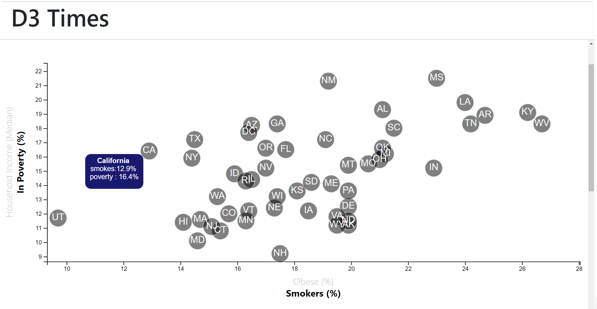

# Risk Factor Data using D3 (interative scatterplot)
Using Behavioral Risk Factor State Survey(BRFSS) Data from the Census Bureau the goal of this visualization is to show the relationship between 4 demographics and answer the questions 

"Is obesity correlated to income or poverty?" 

"Is smoking correlated to income or poverty?"   

# The 1st and 2nd scatterplots show Obesity vs Poverty and Obesity vs Income graphed by state. 

# The next scatterplots show Smoking vs Poverty and Smoking vs Income graphed by state. 

The data is stored in a csv file. The plot is created using D3. The data is charted on a responsive scatterplot. 

* Note: You'll need to use `python -m http.server` initiated from the RiskFActorCode directory on the command line to run the visualization. This will host the page at `localhost:8000` in your web browser. This is because the data is from a stored .csv file

The graphic is coded in Javascript using D3 to create a scatterplot. Each state is represented by a circle labeled with its postal abbreviation. The graphic has a left and bottom axis which can take on two scales. 

Dual Use Axis -The left axis can represent either poverty levels (%) or median family income. The bottom axis can represent either obesity (%) or number of smokers (%). When a new axis is selected the change is a slowed transition so the dots appear to float to their new positions.

Tooltips - Becuse the exact values on a graph can be hard to determine, when any data circle is moused over an information box appears with the data for the current axis displayed.

